<!--
  Hi 👋
  This is the profile README for github.com/yossfmedhat
-->

  

<h1 align="center">Hi, I'm Youssef 👋</h1>

<h3 align="center">
  ML Engineer, Researcher, and Builder of scalable AI ecosystems
</h3>

  

  

  

  

  

---

## 🧠 About Me

- 🧪 **Machine Learning Software Engineer** working on real-world ML systems, from data pipelines to deployment.  
- 🎓 **M.Sc. in Computer Science (Machine Learning)** @ Georgia Tech.  
- 🔬 **Research Assistant @ DILab** – building representation layers and personalization pipelines for online learning.  
- 🎯 I enjoy problems where **research, systems design, and product impact** all intersect.  
- 🍱 Foodie at heart: if I am not debugging a model, I am probably exploring a new restaurant.

> “There’s always a first time”

---

## 🔬 Research Focus – Personalization for Students

I am currently working on **AI-driven personalization for online learning**, focusing on:

- 🧩 **Representation Layer for Students & Content**  
  - Multi-view feature design combining behavioral logs, temporal patterns, semantic embeddings, and course structure.  
  - Vector assembly pipelines for students, content, and activities.

- 🧑‍🎓 **Persona Clustering & Knowledge Gaps**  
  - Discovering latent student personas based on engagement and performance.  
  - Detecting knowledge gaps via similarity thresholds and clustering metrics (e.g., silhouette analysis).

- 🤖 **RL-Based Recommendation Engine (Concept Design)**  
  - Reward shaping around engagement, mastery, and persistence.  
  - Balancing **teacher actions** (interventions, resources) and **student actions** (activity choices).  
  - Designed for integration into a **teacher analytics dashboard** and LMS ecosystem.

- 🔐 **End-to-End Data & Anonymization Pipelines**  
  - Automated anonymization workflows.  
  - ETL from raw LMS logs → enriched features → student-level insights.

This is where my **research brain** and **systems brain** meet.

---

## 📚 Publications

### • SmartCal: A Novel Automated Approach to Classifier Probability Calibration  
**Youssef Medhat**, AutoML'25  
A meta-model framework that unifies multiple calibration algorithms into a single automated pipeline, improving reliability of probability estimates for real-world ML deployments.  
[Google Scholar](https://scholar.google.com/citations?view_op=new_articles&hl=en&imq=Youssef+Medhat#)

---

## 💬 Ask Me About

- 🧠 Representation learning for **personalization & student modeling**  
- 🕸 Building **RAG ecosystems** (LangChain, LangGraph, vector stores, MinIO, OCR, quiz generation)  
- 📈 **Probabilistic calibration** and trustworthy ML (SmartCal, meta-model calibration)  
- 🧮 **Time-series & forecasting** for IoT and KPIs (Airflow + ClickHouse + AutoML)  
- 🧩 **RL-inspired recommendation flows** and experimentation  
- 🧱 Production ML systems: ETL, tracking, monitoring, and retraining loops  
- 💬 Multilingual chatbots with **Rasa** and custom feedback cycles

---

## 🛠 Tech Stack

  <!-- Languages -->
  
  <!-- ML / DL -->
  
  
  
  <!-- LLM / Agents -->
  
  
  <!-- Data / Pipelines -->
  
  
  
  <!-- MLOps -->
  
  
  
  <!-- Databases -->
  
  
  
  <!-- Cloud -->
  

---

## 📊 GitHub Analytics

  
  

  

  

---

## 🎓 Certifications & Badges

  
  
  
  

  
  
  

---

## 🍣 Beyond Code

I am a **research-driven engineer** who also happens to be a **foodie**.

- I love trying new spots, especially sushi and anything experimental.  
- I bring the same curiosity I have for food to my work:  
  trying new architectures, pipelines, and ideas – even when they look unconventional at first.

> “There’s always a first time” – whether it is a new model, a new research direction, or a dish I cannot pronounce yet.

---

  <i>Always happy to connect about research, ML systems, or good food recommendations.</i>

